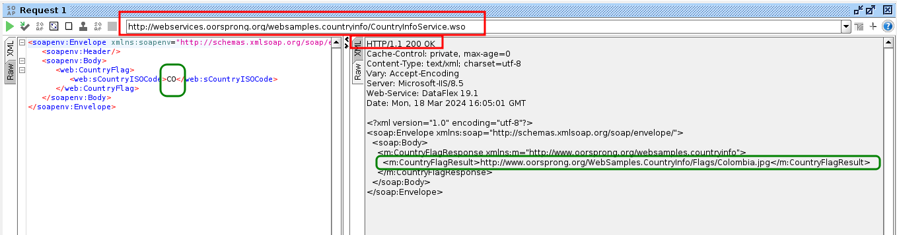

# Ejecución casos de prueba servicio soap

| **Feature:**  | Obtain countries list SOAP API                                                   |
| ------------- | -------------------------------------------------------------------------------- |
| **Scenario:** | [Get countries list with ISO code](../features/countryinfo/country_list.feature) |
|               |                                            |
| **Tester:**   | David Bonelo                                                                     |
| **Date:**     | 2024-03-19                                                                       |
| **Result:**   | Approved                                                                         |

| **Feature:**  | Obtain countries list SOAP API                                                               |
| ------------- | -------------------------------------------------------------------------------------------- |
| **Scenario:** | [get country info using an incorrect iso code](../features/countryinfo/country_list.feature) |
|               |                                                   |
| **Tester:**   | David Bonelo                                                                                 |
| **Date:**     | 2024-03-19                                                                                   |
| **Result:**   | **Failed** [Report #1]()                                                                     |

| **Feature:**  | Obtain country information SOAP API         |
| ------------- | ------------------------------------------- |
| **Scenario:** | Get country's currency                      |
|               |  |
| **Tester:**   | David Bonelo                                |
| **Date:**     | 2024-03-19                                  |
| **Result:**   | Approved                                    |

| **Feature:**  | Obtain country information SOAP API     |
| ------------- | --------------------------------------- |
| **Scenario:** | Get country's flag                      |
|               |  |
| **Tester:**   | David Bonelo                            |
| **Date:**     | 2024-03-19                              |
| **Result:**   | Approved                                |

| **Feature:**  | Obtain country information SOAP API          |
| ------------- | -------------------------------------------- |
| **Scenario:** | Get country's phone code                     |
|               |  |
| **Tester:**   | David Bonelo                                 |
| **Date:**     | 2024-03-19                                   |
| **Result:**   | Approved                                     |

| **Feature:**  | Basic operations SOAP API                  |
| ------------- | ------------------------------------------ |
| **Scenario:** | covert number to words                     |
|               |  |
| **Tester:**   | David Bonelo                               |
| **Date:**     | 2024-03-19                                 |
| **Result:**   | Approved                                   |

| **Feature:**  | Basic operations SOAP API                   |
| ------------- | ------------------------------------------- |
| **Scenario:** | covert number to words                      |
|               |  |
| **Tester:**   | David Bonelo                                |
| **Date:**     | 2024-03-19                                  |
| **Result:**   | Approved                                    |

| **Feature:**  | Basic operations SOAP API                       |
| ------------- | ----------------------------------------------- |
| **Scenario:** | covert number to words                          |
|               |  |
| **Tester:**   | David Bonelo                                    |
| **Date:**     | 2024-03-19                                      |
| **Result:**   | **Failed** [Report #2]()                        |

| **Feature:**  | Basic operations SOAP API                    |
| ------------- | -------------------------------------------- |
| **Scenario:** | sum two integers                             |
|               |  |
| **Tester:**   | David Bonelo                                 |
| **Date:**     | 2024-03-19                                   |
| **Result:**   | Approved                                     |

| **Feature:**  | Basic operations SOAP API                    |
| ------------- | -------------------------------------------- |
| **Scenario:** | Sum invalid integers                         |
|               |  |
| **Tester:**   | David Bonelo                                 |
| **Date:**     | 2024-03-19                                   |
| **Result:**   | **Failed** [Report #3]()                     |

| **Feature:**  | Basic operations SOAP API                          |
| ------------- | -------------------------------------------------- |
| **Scenario:** | Multiply two integers                              |
|               |  |
| **Tester:**   | David Bonelo                                       |
| **Date:**     | 2024-03-19                                         |
| **Result:**   | Approved                                           |
